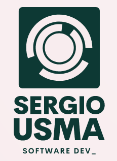

  
   

  <h3><b>Personal portfolio project</b></h3>

<!-- TABLE OF CONTENTS -->

# 📗 Table of Contents

- [📖 About the Project](#about-project)
  - [🛠 Built With](#built-with)
    - [Tech Stack](#tech-stack)
    - [Key Features](#key-features)
  - [🚀 Live Demo](#live-demo)
- [💻 Getting Started](#getting-started)
  - [Setup](#setup)
  - [Prerequisites](#prerequisites)
  - [Install](#install)
  - [Usage](#usage)
  - [Run tests](#run-tests)
  - [Deployment](#deployment)
- [👥 Authors](#authors)
- [🔭 Future Features](#future-features)
- [🤝 Contributing](#contributing)
- [⭐️ Show your support](#support)
- [🙏 Acknowledgements](#acknowledgements)
- [❓ FAQ (OPTIONAL)](#faq)
- [📝 License](#license)

<!-- PROJECT DESCRIPTION -->

# 📖 Hello Microverse 

**Personal_portfolio** is a project that consists of building a personal portfolio site. This project is part of the Microverse curriculum. In this first part, the project is built using only HTML and CSS. In the future, more technologies will be added. Besides, includes a README file with the project description and two sections: one with the navigation bar, and another with author's name and links to the author's social networks.

[Click here](https://www.loom.com/share/ab6809d556574bbcb8ec807e629eb4e0) to see the presentation video

## 🛠 Built With 

- HTML
- CSS
- JavScript
- Linters

### Tech Stack 

In this project was only used HTML and CSS. More technologies Coming soon.

<!-- Features -->

### Key Features 

- **Semantic HTML**
- **CSS**
- **Responsive Design**
- **Use of DOM**
- **Use of Linters**

(<a href="#readme-top">back to top</a>)

<!-- LIVE DEMO -->

## 🚀 Live Demo 

- If you want to see a preview from the project go and [click here!](https://sergio-usma.github.io/Personal_portfolio/)

(<a href="#readme-top">back to top</a>)

<!-- GETTING STARTED -->

## 💻 Getting Started 

To get a local copy up and running, follow these steps.

### Prerequisites

In order to run this project you need:

- VS Code or an IDE
- NodeJS
- Git
- GitHub account

### Setup

Clone this repository to your desired folder:

1. Click the green "Code" button and copy the repository URL.

2. Open a terminal window and navigate to the directory where you want to clone the repository.

3. Type "git clone" in the terminal window, followed by a space and then paste the repository URL https://github.com/sergio-usma/Personal_portfolio. Press "Enter" to clone the repository.

4. Verify that the repository has been cloned successfully by checking the contents of the directory where you cloned it.

5. That's all, you have the code!

### Install

Install don't required.

### Usage

Edit the code using VS Code or an IDE.

### Run tests

Test don't required.

### Deployment

You can deploy this project using your preferred deployment method. However we recommend using GitHub Pages link given in the project's description or in the Live Demo section.

(<a href="#readme-top">back to top</a>)

<!-- AUTHORS -->

## 👥 Authors 

👤 **Author**

- GitHub: [@sergio-usma](https://github.com/sergio-usma)
- Twitter: [@VonUsma](https://twitter.com/vonusma)
- LinkedIn: [Sergio Andres Usma](https://linkedin.com/in/sergioandresusma)

(<a href="#readme-top">back to top</a>)

<!-- FUTURE FEATURES -->

## 🔭 Future Features 

These are the coming soon features for this project:

1. [ ] Projects section pop-ups.
2. [ ] Full features mobile & desktop version.

(<a href="#readme-top">back to top</a>)

<!-- CONTRIBUTING -->

## 🤝 Contributing 

Contributions, issues, and feature requests are welcome!

Feel free to check the [issues page](../../issues/).

(<a href="#readme-top">back to top</a>)

<!-- SUPPORT -->

## ⭐️ Show your support 

If you like this project, please consider supporting us! Your support helps us to continue developing and improving our project for everyone to enjoy. Whether it's a small donation, sharing the project with your friends, or contributing your skills and expertise, every little bit makes a huge difference. With your support, we can create something truly amazing together. Thank you for being a part of our community and helping us to make a difference!

(<a href="#readme-top">back to top</a>)

<!-- ACKNOWLEDGEMENTS -->

## 🙏 Acknowledgments 

I would like to thank Microverse for his groundbreaking work on data visualization in his lessons.

(<a href="#readme-top">back to top</a>)

<!-- FAQ (optional) -->

## ❓ FAQ (OPTIONAL) 

- **How do I set up the project?**

  - Clone the repository from GitHub.

- **How can I contribute to the project?**

  1. Fork the repository on GitHub.
  2. Create a new branch for your changes using git checkout -b my-feature-branch.
  3. Make your changes and commit them with descriptive commit messages.
  4. Push your changes to your forked repository.
  5. Submit a pull request to the original repository.
  6. Wait for feedback and iterate on your changes as needed.

(<a href="#readme-top">back to top</a>)

<!-- LICENSE -->

## 📝 License 

This project is [MIT](./LICENSE) licensed.

(<a href="#readme-top">back to top</a>)

